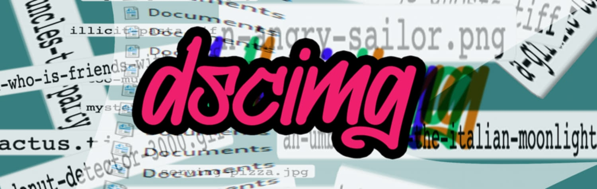

# dscimg


> CLI program that uses takes in image filepaths, and uses Cloudflare Workers AI to rename them to a natural-language description.



### Context

I am a simple man. I right click, save as, and then I keep `23nr129fn1u49fn1_BIG.jpeg` on my desktop forever, afraid of what it may contain. Today, using cutting-edge technology, we can ask a robot what images we downloaded, and it will respond with a wholly incorrect answer.

## Installation

If you don't have the following configuration variables set, the program (should) prompt you to enter them. If that doesn't work, run: `dscimg config`.

You'll need two Cloudflare-centric information tidbits to kickstart your journey:

* `cloudflareAPIToken`: - Your [Cloudflare API token](https://developers.cloudflare.com/fundamentals/api/get-started/create-token/) with cf workers ai enabled in scope.
* `cloudflareEndpoint`: - A cloudflare [AI Gateway](https://developers.cloudflare.com/ai-gateway/) URL for the [correct image-to-text model](https://developers.cloudflare.com/workers-ai/models/#image-to-text); this model being either `llava-hf/llava-1.5-7b-hf` or `uform-gen2-qwen-500m` as of June '24. This endpoint should look something like this: `https://gateway.ai.cloudflare.com/v1/<some secret shit>/<more secret shit>/workers-ai/@cf/llava-hf/llava-1.5-7b-hf`.

## Usage

```sh
dscimg "/home/dad/Pictures/unknown-pictures"
```

Takes in folders, files, and probably globs. Filters out the non-images. Will (probably) not overwrite your files. But, if you're scared, pass it the `-d` (dry run) arg.

Example Output:

```sh
Renamed test.jpg to man-wearing-a-green-shirt-with-a-watermelon-on-his-face.jpg (764ms)
```

Trailing numerals are length of server "thinking" time. I was just curious.

## Money, money, money

[Cloudflare Workers does its pricing in "Neurons" to make it more of a pain in the ass to understand.](https://developers.cloudflare.com/workers-ai/platform/pricing)My back-of-the-napkin math indicates that each request to `llava-hf/llava-1.5-7b-hf` is about .32 neurons. So, in theory, you get 31,250 requests per day. Cool.
